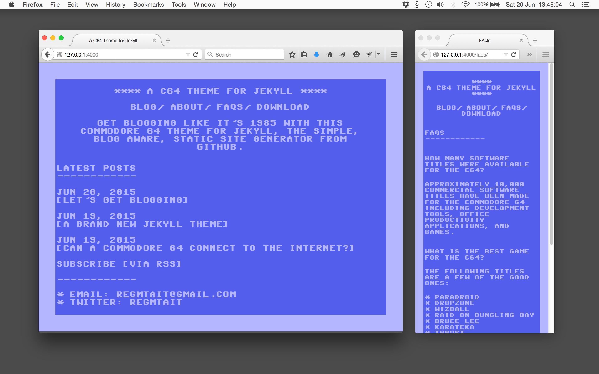

# A Commodore 64 theme for Jekyll

Let's get blogging like it's 1985 with this C64 theme for [Jekyll](http://jekyllrb.com), the simple, blog aware, static site generator from GitHub.

## Amazing features

* No plug ins, so you can host on [GitHub pages](https://pages.github.com/), if you like
* A blog archive template
* An uppercase-only font, as we don't want to go mad with too many bells and whistles. (Want a lower case font? Maybe [try one of these](http://style64.org/c64-truetype).)
* Super modern responsive layout

## Credits

By [Reg Tait](http://regmtait.co.uk). The CBM font was Created by Christian Vogelgsang and included with [VICE](http://sourceforge.net/projects/vice-emu/) 2.4.2 C64 emulator, under the terms of the GNU General Public License.

## Copyright

This is free. You can do what you like with it.